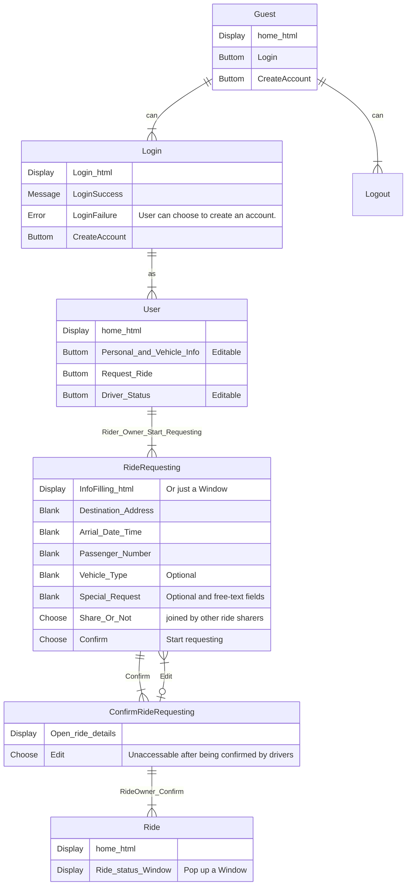

# Web-APP_Ride-Sharing-Service


Go to ./docker-deploy/web-app/Ride_Sharing_Service/

Start your server by
```
python3 manage.py runserver 0:8000
```
*Using 0.0.0.0 means the server runs on "all" interfaces on the machine, including the one which has a public IP.

Then go to http://vcm-30579.vm.duke.edu:8000/ or http://vcm-30900.vm.duke.edu:8000/

# Project Overview

